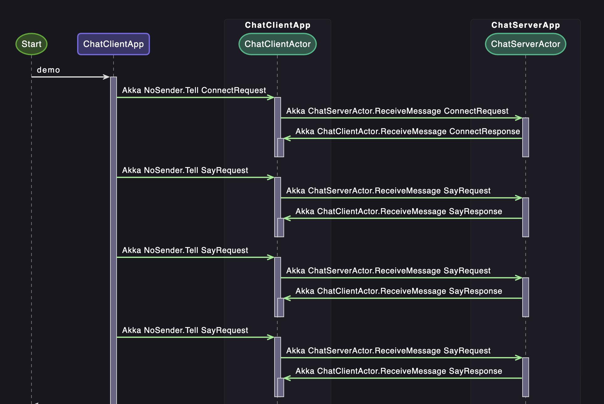
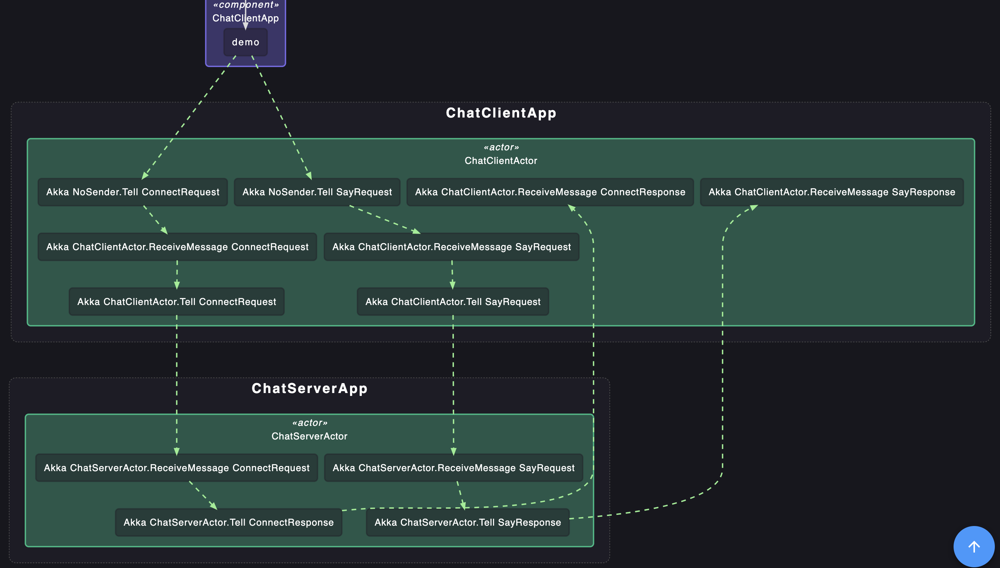

# Akka.OpenTelemetry

This is a library that provides OpenTelemetry instrumentation for Akka.NET.
Status is work in progress.

Tracing currently works for:

* Local Actors
* Remote Actors
* ActorSelections

And where it doesn't work:

* Cluster Actors
* Remote Deployed Actors
* Async-Await, no tracing context is stored between async/await calls

Akka.OpenTelemetry has been tested with Asynkron TraceView

[Asynkron TraceView](https://github.com/asynkron/TraceViewDeploy)





There are currently no configuration support, all actors in `/user/`-space are traced.

Pull-requests are welcome.

## Getting started

### Installation

Install the NuGet package `Akka.OpenTelemetry` into your Akka.NET application.

### Configuration

```csharp
var tracerProvider = Sdk.CreateTracerProviderBuilder()
    .SetResourceBuilder(ResourceBuilder.CreateDefault()
        .AddService("Akka.OpenTelemetry.Demo")
    )
    .AddAkkaInstrumentation()
    .AddOtlpExporter(options =>
    {
        options.Endpoint = new Uri("http://localhost:4317");
        options.ExportProcessorType = ExportProcessorType.Batch;
    })
    .Build();
    

//augment config with OpenTelemetry settings
var bootstrap = BootstrapSetup.Create().WithOpenTelemetry();
var system = ActorSystem.Create("my-system", bootstrap);
var props = Props.Create<MyActor>();
var reff = system.ActorOf(props);
```